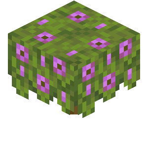

    
    <h1>Azalea</h1>
    
A Light-Weight Minecraft Protocol

    

        
        
        
        
    

## About

Azalea was created just for fun and to learn more about how Minecraft works.
Although I decided to make it public and work on it more.
Azalea is a **light-weight Minecraft Protocol** that is written in **Java**.

Azalea is a very bare-bones protocol currently still in development.
It is **not recommended** to use this in a **production environment** right now.

This project will continue to be worked on and updated as time goes on.
I'm not planning on finishing it anytime soon as I want to add more features and make it more stable than it currently is right now.

## Currently Working On

*This list is in order on what is going to be worked on.*

- [x] Working Protocol
- [x] Chunk Loading / Unloading
- [x] Ticks
- [x] World System
- [ ] Multiplayer Support *(Somewhat Working)*
- [x] Packet Compression
- [ ] Block / Item Registry
- [ ] Bossbars / Actionbars / Chat
- [ ] Particles
- [ ] Entities
- [ ] Inventory Support
- [ ] Lighting???
- [ ] Chunk Saving
- [ ] Improve performance / API
- [ ] Final Touches

## Current Features Being Worked On

| Feature            | Progress | Notes                                                                                                                                                                    |
|--------------------|:--------:|--------------------------------------------------------------------------------------------------------------------------------------------------------------------------|
| Chunks             |    🟡    | `Chunks are a very complex system, which needs to be done right. Currently chunks are using ~200MB of ram which is a no go!`                                             |
| Worlds             |    🟢    | `Worlds are currently being implemented into the main API, the old API wasn't made for worlds thus there's lots that needs to be chagned.`                               |
| Ticking System     |    🟢    | `There is a very simple ticking system already implemented into the API, it works for now. This includes Players, Entities, and Packet Syncing for Multiplayer Support.` |
| Multiplayer System |   🟡   | `There is a multiplayer system that will be added, currently not working on it. We are needing to complete chunks and ticks before beginning work on this system.`       |

## Contributing

If you would like to contribute to Azalea, please read the [CONTRIBUTING.md](./CONTRIBUTING.md) file.

## License

Azalea is licensed under the [MIT License](./LICENSE).
